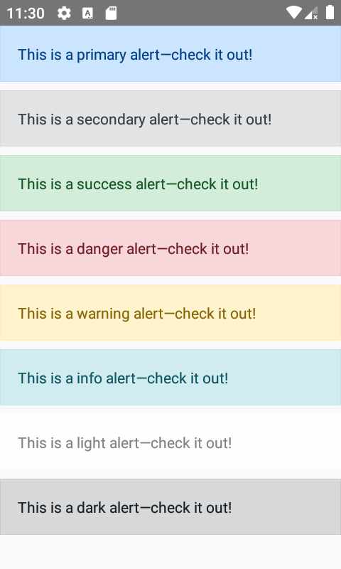

<hr>
<p align="center">
  <b>WIP</b>
</p>
<hr>
<br />

# Demp App for [react-native-bootstrap](https://github.com/react-native-bootstrap/react-native-bootstrap)

This App showcase the components written in react-native-bootstrap

## :camera: Screenshots

<div style="display:flex;" >
  
</div>

## :rocket: Getting Started

1. Get the code

    ```bash
    git clone https://github.com/react-native-bootstrap/react-native-bootstrap-app.git && cd react-native-bootstrap-app
    ```

2. Install dependencies

    ```bash
    npm install
    ```

3. Start metro server in terminal

    ```bash
    npm start
    ```

6. In another terminal run the project

    ```bash
    # for iOS
    react-native run-ios
    ```

    ```bash
    # for android
    react-native run-android
    ```

## ❤️ Contributing [](http://makeapullrequest.com) 

Finding bugs, sending pull requests or improving docs - any contribution is welcome and highly appreciated. To get started, head over to our [contribution guidelines](CONTRIBUTING.md). Thanks!

See also the list of [contributors](https://github.com/alexakasanjeev/react-native-bootstrap-app/contributors) who participated in this project.

## 👨‍💻 Authors

Sanjeev Yadav

[](https://twitter.com/alexakasanjeev)

[](https://github.com/alexakasanjeev)

## 📣 Acknowledgements

* [MageCart](https://github.com/alexakasanjeev/magento_react_native): React Native E-Commerce app
* [README-Template.md](https://gist.github.com/PurpleBooth/109311bb0361f32d87a2) by [Billie Thompson](https://github.com/PurpleBooth)

## 🛡 License

This project is licensed under the GNU v3 Public License License - see the [LICENSE.md](LICENSE.md) file for details.
